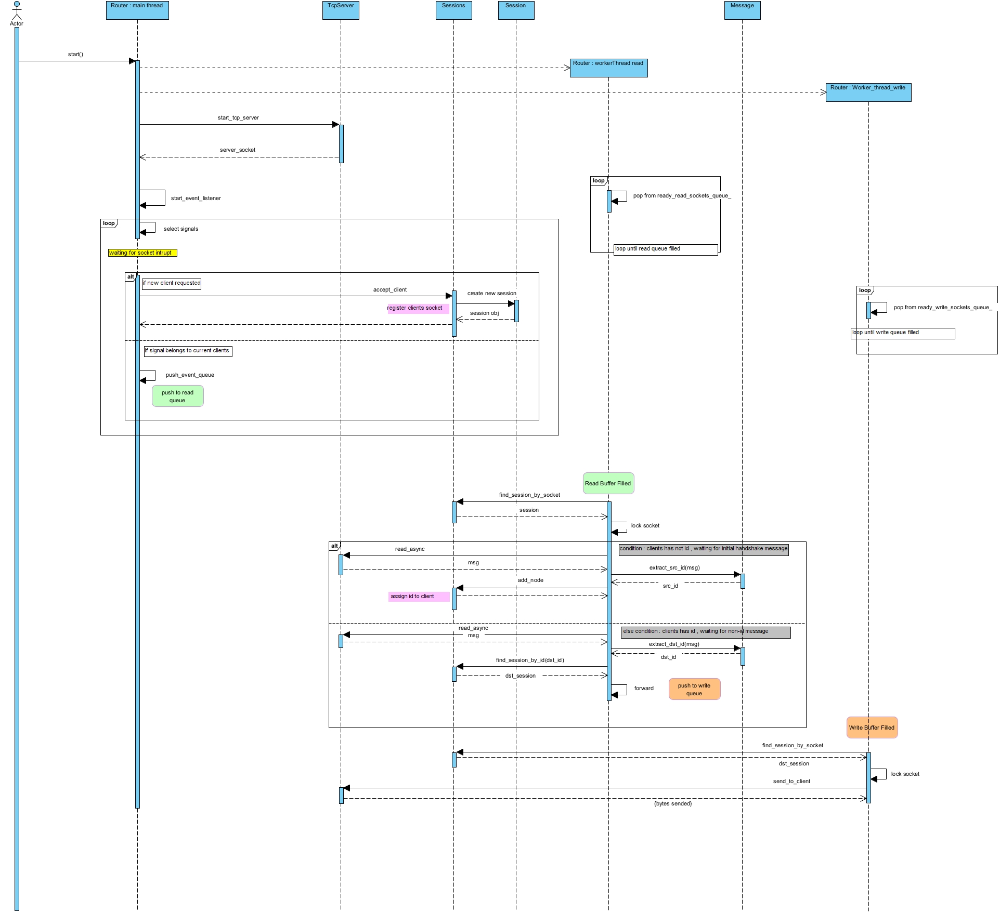

# ISC Programming Challenge 2 : Message Routing System


## Problem
The challenge is identical to the ISC Programming Challenge; you can review the problem statement [here](https://github.com/hamed65kz/ISC-Challenge?tab=readme-ov-file#system-components).

The goal of this version is to replace Boost.Asio with custom-developed code and to implement an event listening mechanism independently.


## Solution

The system solution prioritizes _performance at the router_ and _simplicity at the endpoints_.

  

  

### Router Design

  

For designing the router, we utilize an event-driven model along with the select() method for I/O multiplexing. The core concept of the solution was described in the [previous version](https://github.com/hamed65kz/ISC-Challenge/blob/master/README.md#Solution); in this update, we have replaced Boost.Asio with custom-developed code. 

In summary, we monitor socket events and perform asynchronous reads on sockets that are ready. Worker threads pick ready sockets from a queue and execute recv() calls in asynchronous mode. After processing the message, the socket is moved to a write-ready queue. Subsequently, worker threads pop sockets from this write queue and perform send() operations.

  
The rest(node and messaging mechanism) is the same and didnt changed.

#### Task Distribution Strategy for Router Worker Threads

Threre is two model for distributing read/write tasks across router worker threads:

1.  **Dedicated Thread Roles (Read/Write Separation):**
    
    -   **Approach:**  Assign separate threads to handle read and write operations exclusively.
        
    -   **Advantages:**
        
        -   Logical separation of concerns
        -   Simplified design and debugging due to clear task boundaries.
        -   Optimal when read and write workloads are balanced and predictable.
            
    -   **Limitations:**     
        -   Risk of underutilized threads if read/write loads become uneven (e.g., read-heavy bursts leave write threads idle, or vice versa).
            
2.  **Unified Thread Model (Hybrid Task Queues):**
    
    -   **Approach:**  Allow all threads to dynamically pick tasks from a shared pool of read/write queues.
        
    -   **Advantages:**
        
        -   Improved load balancing, especially during imbalanced workloads (e.g., threads assist overloaded queues).
        -   Better resource utilization under fluctuating or unpredictable traffic.
        
	   -   **Trade-offs:**
        
	        -   Increased complexity in thread synchronization and task prioritization.
       
For simplicity, I am currently following the first approach. However, I believe that in the router context, reader threads are more critical, and all threads should assist with reading. Therefore, the second approach seems more appropriate for the router, and I have listed it in future work tasks.

#### Queues Optimization Strategy
To minimize latency and boost performance, I replaced idle thread polling (sleeping on empty queues) with **conditional variables**. Threads now wait efficiently and are _instantly notified_ when tasks arrive. This ensures threads wake immediately to process tasks.

### Sequence Diagram

For better understanding of solution structure, I model the solution with object-level sequence diagram plus threads as a separate lifelines.



## Supported Platforms

  

-  **Windows** - successfully built, run, and tested.

  

-  **Linux** - Not Tested

  

  

## Build Routine for CMake Project

  

### Build Steps

  

  

#### 1. Clone the Repository

  

This project includes `spdlog` as a Git submodule, so it is necessary to clone the repository recursively to include the `spdlog` repository as well. Use the following command:

  

  

```bash

git  clone  --recurse-submodules  https://github.com/hamed65kz/ISC-Challenge.git

```

  

  

#### 2. VCPKG Setup

  

This project utilizes [vcpkg](https://github.com/microsoft/vcpkg) for managing external libraries. Specifically, we require `gtest` for unit testing.

  
Fortunately, you do not need to install vcpkg and its dependencies manually. The project includes an automated routine that installs vcpkg and subsequently installs the dependencies listed in the `Dependencies.txt` file located in the root of the project. This routine will be triggered when you start configuring the CMake project.

The Boost.Asio is eliminated but still we need gtest package, so still keep vcpkg section.  

#### 3. Build the Project

```bash

cmake  -S  .  -B  out

cd  out

cmake  --build  .  --config  Release

```


During the CMake configuration process, the vcpkg installer script will run in a separate console, pausing cmake until it finishes. This script will set up vcpkg and install the external packages specified in the Dependencies.txt file. After the installation is complete, the user should close the console to allow the CMake process to proceed with its configurations.

## How to Run

  

### Running the Router Executable

  

To run the router executable, use the following command:

  

```bash

ISC-Router.exe <listen_port>

```

  

For example, to run the router on port 6060:

  

```bash

ISC-Router.exe  6060

```

  

### Running the Node Executable

  

To run the node executable, use the following command:

  

```bash

ISC-Node.exe <id> <dstid> <router_ip> <router_port>

```

 For example, to run a node with ID 3 that communicates with destination ID 5 through the router at IP address 127.0.0.1 on port 6060, use:
 

```bash

ISC-Node.exe  3  5  "127.0.0.1"  6060

```

a sample running example is like:

```bash

ISC-Router.exe  6060

ISC-Node.exe  5  3  "127.0.0.1"  6060

ISC-Node.exe  3  5  "127.0.0.1"  6060

```

### Important Note
All nodes will send a message to destination node on node startup.

  
## Memory Profiling
I use Valgrind to detect memory-related problems. I run it for both the Router and Node, and the results are displayed below.

### The Router
The Valgrind didn't run for new Router.

### The Node
I ran Valgrind on the Node application and suddenly terminated its execution, which resulted in reports of some memory blocks that were not freed. Upon reviewing the code, I found that these memory blocks were allocated internally within the constructors of the Node and TCPSocket classes. This internal memory is supposed to be released in their respective destructors. However, in the Node, there is an infinite while loop that prevents objects from going out of scope, which means the destructors are never called.

To confirm that all the unreleased memory was associated with the internal allocations of these two classes, I altered the code to add a round limit. This modification enabled the execution to eventually break out of the while loop and invoke the destructors. After making this change, I ran Valgrind once more, and it indicated that there were no memory leaks.
Keeping only internal memories and nothing else implies that memory will not growth over time.


below screen shows Valgrind output for the Node before editing the infinite loop and dont call objects destructors:


below screen shows Valgrind output for the Node after editing the loop, allowing destructors to be invoked and internal memory to be released:


## Demonstration
  This program does amazing things. Below is a demonstration of its execution:


## Future Works
A. The node should utilize send queue to manage bursts of traffic effectively.

B. Router get new memory for each message, for better performance we could use pre-allocated memories.

C. For scalability, select() has limitations (max socket fd, performance).epoll() on Linux are more scalable.

D. Implement internal buffers for handling partial send and recv.

E. Apply unified thread model on the Router task distribution mechanism.

F. Performance and CPU profiling, measure message throughput.

G. Perform memory check for the Router with Vagrind.

H. Apply frame synchronization or framing, it lets the receiver identifies the frame/message boundaries. 

J. Apply thread affinity on main thread and worker thread to avoid unneccesray context switches and dont distrupt threads caches 